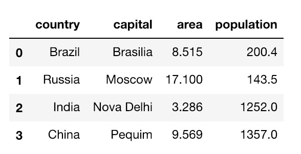
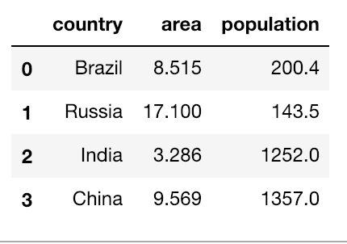
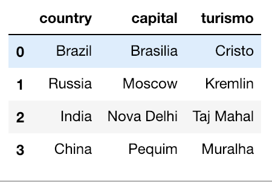
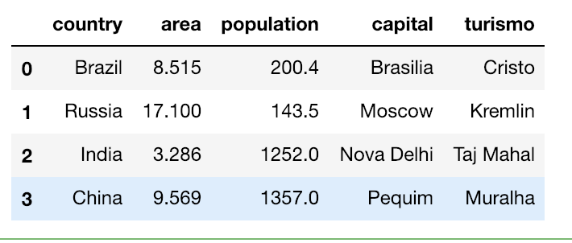

# Pandas


## O que é, aonde vive, do que se alimenta?

O Pandas é um biblioteca open source amplamente utilizada dentro da comunidade acadêmica, que se tornou extremamente útil pelo seu desempenho e pela sua capacidade de simplificar tarefas complicadas de manipulação de dados.

- [__Site Oficial__](https://pandas.pydata.org/)

## Importando

Para utilizarmos bibliotecas externas no Python, é necessário instala-las e importá-las:

```Python
import pandas as pd
```

`as pd` é uma forma de dar um alias para a biblioteca, dessa forma, toda vez que formos utilizar a biblioteca no código, podemos apenas escrever `pd.comando`.

## Criando DataFrames

Um data frame é semelhante a uma matriz mas as suas colunas têm nomes e podem conter dados de tipo diferente. Um data frame pode ser visto como uma tabela de uma base de dados, em que cada linha corresponde a um registo (linha) da tabela. Cada coluna corresponde às propriedades (campos) a serem armazenadas para cada registo da tabela.



### A partir de dicionarios
O pandas nos permite criar esses DataFrames, uma forma de fazer isso é a partir de dicionários:

```Python
import pandas as pd

dicionario = {
    "country":["Brazil","Russia","India","China",],
    "capital": ["Brasilia", "Moscow", "Nova Delhi", "Pequim"],
    "area": [8.515, 17.10, 3.286, 9.569],
    "population":[200.4, 143.5, 1252, 1357]
}

brics = pd.DataFrame(dicionario)
```

Também podemos definir labels tanto para as colunas, quanto para as linhas. Para isso, podemos utilizar uma lista.

```Python
linha_labels = ['US', 'AUS', 'JAP', 'IN']
coluna_labels = ['a', 'b', 'c', 'd']

#renomeia as linhas
brics.index = linha_labels

#renomeia as colunas
brics.columns = coluna_labels
```

### A partir de CSV

Embora criar DataFrames a partir de dicionário seja bem útil, quando estivermos tratando com um volume muito grande de dados, ficará inviável utilizar esse método. Por isso, vamos aprende a como criar DataFrames a partir de CSV.

```Python
csv_data_frame = pd.read_csv('caminho_do_arquivo.csv')

#Verificando se funcionou:
csv_data_frame.head()
```

*Obs: O método `.head` imprime os primeiros dados do DataFrame*

## Acessando items de um DataFrame

```Python

df[['nome_coluna1','nome_coluna2']]

#Exemplo
brics[['country','capital']]
```

## Resgatando dados de um DataFrame

Uma forma de filtrar dataframes é utilizando o método `loc`. Este método é primariamente baseado nas labels da colunas, porém podemos utilizar com um array booleano também.

```Python
df.loc[<linhas>, <colunas>]
```

Uma forma bem interessante de utilizar o loc é para filtrar nosso DataFrame com base em algumas condições. Digamos que apenas queremos as informações do Brasil:

```Python
condicao = brics['country'] == 'Brasil'
brics.loc[condicao]
```

## Ordenando um DataFrame

Podemos ordenar um DataFrame com base em suas colunas, para isso utilizamos o método `sort_values()`

```Python
brics.sort_values(by='area', ascending=False)
```

## Excluindo Colunas

As vezes podemos ter um DataFrame com informações desnecessárias e gostaríamos de excluir. Para isso, utilizamos o método `del`

```Python
del df['capital']
```

## Merge

É bem possível que na nossa jornada como cientistas de dados, nós venhamos a nos deparar com informações espalhadas em vários datasets. Digamos que eu tenho um dataset contendo as informações populacionais das cidades e outro com as informações turísticas delas e gostaríamos de visualizar tudo em mesmo dataset.

__DataFrame Popolação__



__DataFrame Turismo__



```Python
merge = pd.merge(dataframe_pop, dataframe_turismo, on='country')
```

__Resultado__



## Saiba Mais

- [Intermediate Python for Data Science (DataCamp)](https://campus.datacamp.com/courses/intermediate-python-for-data-science/)

### [>>> Próximo Capitulo - Mão na Massa!](handson.md)