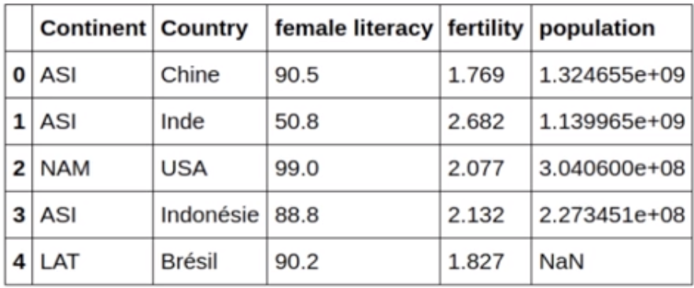
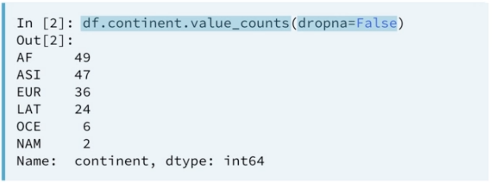
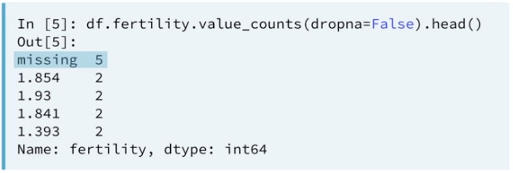
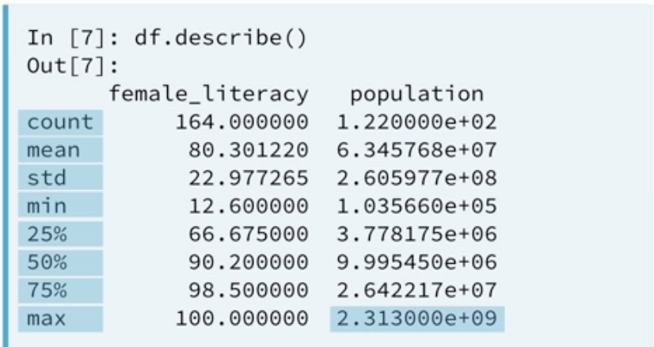

# Examinando Datasets

Antes de começarmos a analisar dados, é preciso se certificar que eles estão prontos para serem analisados. Os Dados raramente virão limpos e organizados e é necessário diagnosticar esses problemas para que a nossa análise não acabe sendo incorreta ou enviesada.

## Problemas Comuns

- __Nomes de colunas inconsistentes:__ maiúsculas misturadas com minusculas, espaços em branco perdidos... isso é um problema por que quando formos selecionar essas colunas pelo nome `df.` ou `` podemos ter problemas.
- __Informações faltando:__ As vezes temos alguns NaN ou dados faltando em nosso dataset que precisam ser lidados antes de uma possível análise começar;
- __Colunas Duplicadas:__ Podem gerar vieses na análise;
- __Os tipos das colunas podem sinalizar valores inesperados:__ Uma coluna chamada população que está como sendo do tipo `Object` pode significar a presença de valores não numéricos.
- __Dados Discrepantes:__ Ter valores como 32 para dia do mês;

### Exemplo



- Valores faltando na coluna de população;
- Nomes de Colunas inconsistentes;
- Países em Frances;

## Abordagens

Podemos fazer uma análise rápida do nosso dataset utilizando alguns métodos do Pandas:

- `.head()` e `.tail()` para visualizar superficialmente o inicio e o fim do dataset e tentar identificar alguns problema como valores ausentes;
- `.columns` para mostrar as colunas: isso pode ajudar a identificar espaços em branco perdidos por exemplo
- `.shape()` para retornar o número de linhas e colunas de um dataset;
- `.info()` para visualizar diversas informações importante do nosso dataset;

## Análise exploratória de dados

Aqui vamos ver algumas análises exploratórias que podemos fazer, começando por:

### Contagem de frequência: Colunas

Podemos analisar a quantidade de valores e tipos das colunas dos nossos dados, possibilitando uma análise mais profunda: Primeiro selecionamos a coluna desejada, chamamos o método `value_counts` e passamos como parâmetro `dropna=False` para considerar valores faltantes (`NaN`).

``` python
df.continent.value_counts(dropna=False)
```



Ao fazer isso com a coluna de fertilidade, podemos ver que junto com números a gente tem a string `missing` perdida ali no meio;



### Sumarização

Esse aqui é importante para conseguirmos notar dados discrepantes ou pontos fora da curva. Podemos utilizar o método `describe()` para termos uma análise mais estatística e conseguirmos notar dados que talvez não façam sentido.



## Saiba Mais

- [Cleaning Data in Python (DataCamp)](https://campus.datacamp.com/courses/cleaning-data-in-python/)

### [>>> Exercícios](handson.md)
### [>>> Próximo Capitulo - Limpando Dados Part.1!](limpando-dados-part1.md)
