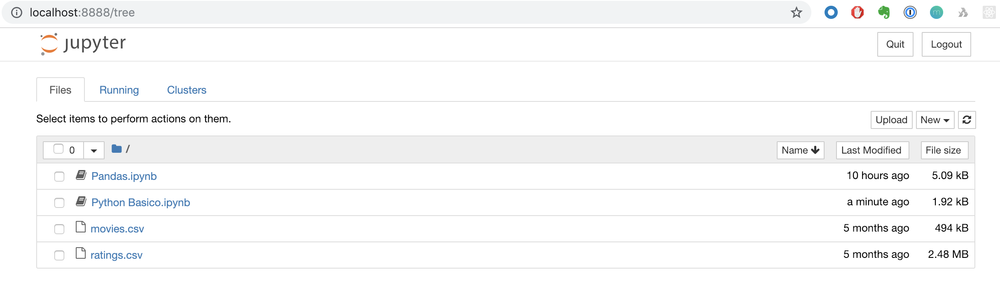

# Exercicios Jupyter Notebook

1. Clone esse repositório para a sua máquina;

```sh
$ git clone https://github.com/betinacosta/workshop-datascience.git
```

2. Acesse o repositório pelo terminal e vá até a pasta `aula-02`

```sh
$ cd workshop-datascience/aula-02/notebooks
```

3. Execute o comando `jupyter notebook` ou abra a aplicação

```sh
$ jupyter notebook
```

4. Acesse http://localhost:8888



5. Abra os notebooks com os exercícios

6. PROFIT \o/