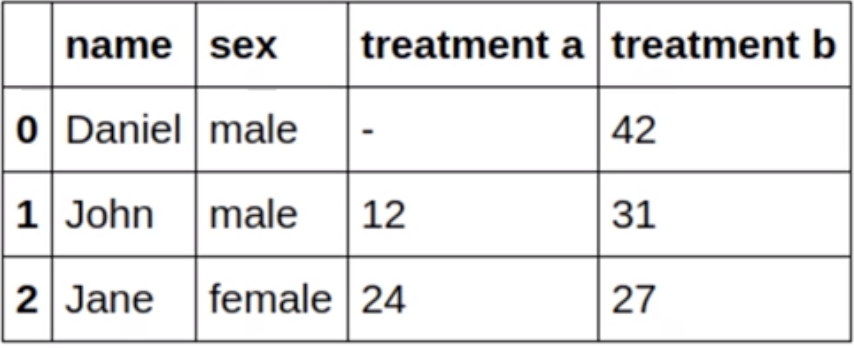
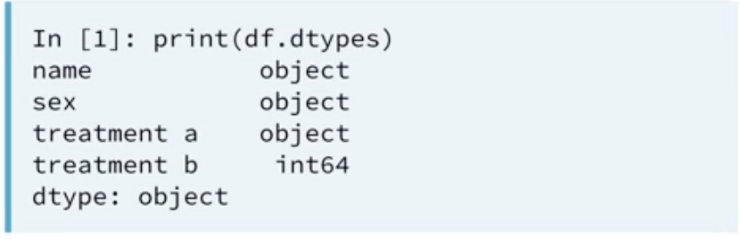
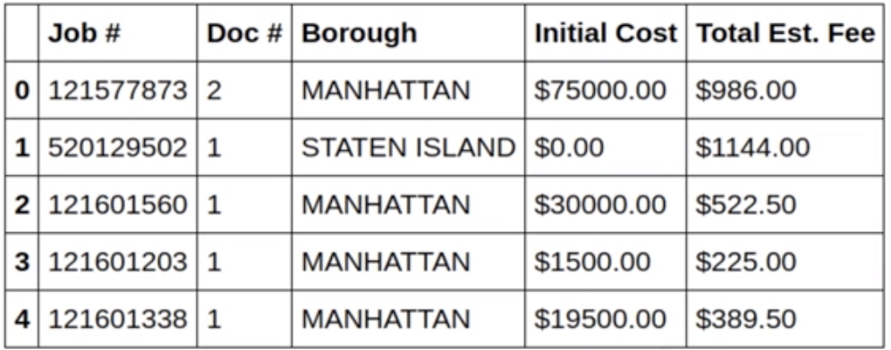
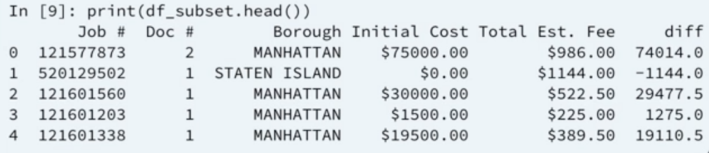

# Limpando Dados Part.1

## Convertendo tipos de Dados

Em algumas situações pode ser necessário converter alguns dados. Digamos que a gente tenha o seguinte dataset:


As colunas `Name` e `Sex` deveriam ser do tipo string e as `treatment a` e `treatment b` do tipo int. Agora vamos usar o método `df.dtypes` para ver qual o tipo real dessas colunas



Podemos observar que a coluna `treatment a` está marcada como sendo um object (um generic para string). Isso acontece pelo fato da coluna ter um `-` como entrada.

Nesses casos, é interessante fazer um conversão de tipo para deixar nosso dataset mais conciso.

### Convertendo para String

```python
df['treatment b'] = df['treatment b'].astype(str)
```

### Convertendo para Números

```python
df['treatment a'] = pd.to_numeric(df['treatment a'], errors='coerce')
```

O parâmetro `errors='coerce'` deve ser utilizado para setar valores inválidos (como o `-`) como `NaN`

### Convertendo para Categoria

```python
df['sex'] = df['sex'].astype('category')
```

Para representarmos a coluna `sex` talvez seja interessante usarmos algo além de string, podemos interpretar essa coluna como sendo uma `categoria`. O tipo categoria tem algumas features bem úteis:

- Pode tornar o DataFrame menor (em termos de memória)
- Pode ser utilizado por outras bibliotecas python para análise

## Utilizando Expressões regulares para limpar Strings

O Python tem diversas bibliotecas para manipulação de strings, sendo `re` para expressões regulares umas delas

### Validando Valores Monetários

Preços podem ser representados de diversas formas em um dataset:

- 7
- R$7
- R$7,00
- 7.89
- R$7,987

Podemos utilizar regex para filtrar somente preços que satisfaçam um determinado padrão:

```python
import re

pattern = re.compile('\$\d*\.\d{2}')
result = pattern.match('R$7,987')

bool(result)
```

## Usando funções para limpar dados

Muitas vezes a limpeza que precisamos fazer é complexa e requer múltiplos passos e para isso podemos aplicar funções aos datasets.

Vamos usar como exemplo o seguinte dataset:



E queremos validar as colunas `Initial Cost` e `Total Est. Fee`, removendo o sinal de dólar($), converter para um tipo numérico, retornar a diferença entre os dois e armazenar em uma nova coluna:

```python
import re
from numpy import NaN

pattern = re.compile('^\$\d*\.\d{2}$')

def diff_money(row, pattern):
    icost = row['Initial Cost']
    tef = row['Total Est. Fee']

    if bool(pattern.match(icost)) and bool(pattern.match(tef)):
        icost = icost.replace("$", "")
        tef = tef.replace("$", "")

        icost = float(icost)
        tef = tef = float(tef)

        return icost - tef

    return(NaN)
```

Para fazer isso, utilizaremos o método `apply` que "aplica" uma função a um dataset:

```python
df['diff'] = df.apply(diff_money, axis=1, pattern=pattern)
```

onde `diff_money` é a função que criamos a cima, `axis=1` se refere as linhas do dataframe (parâmetro `row` da nossa função) e `pattern` é a regex que escrevemos a cima. Isso resulta em:



## Saiba Mais

- [Cleaning Data in Python (DataCamp)](https://campus.datacamp.com/courses/cleaning-data-in-python/)

### [>>> Exercícios](handson.md)
### [>>> Capitulo Anterior - Examinando Datasets](examinando-datasets.md)